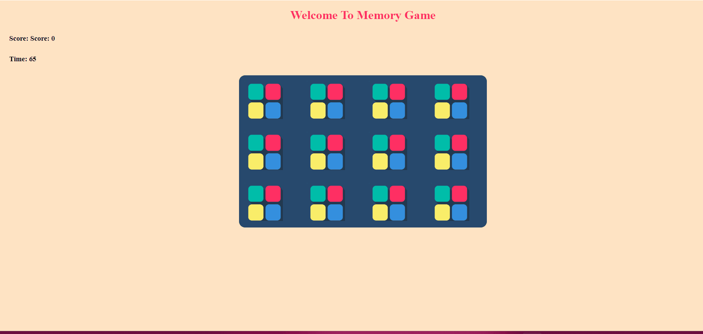

# Memory Game

This is a simple Memory Game application built with HTML, CSS, and JavaScript. The app challenges players to match pairs of cards by remembering their positions, providing a fun way to test and improve memory skills.

## Features

- **Card Matching**: Players flip cards to find matching pairs.
- **Score Tracking**: The game tracks the player's score based on the number of moves taken.
- **Responsive Design**: The game is responsive and works well on different screen sizes.

## Technologies Used

- **HTML**
- **CSS**
- **JavaScript**

## Project Structure

project-folder/
│
├── img/
├── app.js
├── index.html
├── style.css
└── memory-game.gif

- **img/**: Folder containing image files used for the game cards.
- **app.js**: Contains the JavaScript code for the game functionality.
- **index.html**: The main HTML file that contains the structure of the game.
- **style.css**: Contains the CSS styles for the game design.
- **memory-game.gif**: A GIF demonstrating the functionality of the memory game.

## Demo

https://ayseugurlu.github.io/Memory-Game/

## Outcome

## License

This project is licensed under the MIT License.

### MIT License

